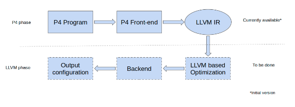

# P4 ➡ LLVM IR ➡ JSON
P4LLVM is an LLVM based compiler for P4, a networking language.

This project is built upon open-source P4 compiler called [p4c](https://github.com/p4lang/p4c).
The LLVM IR emitter is a pass over p4c IR. We reuse the p4c front-end and translate p4c IR to LLVM IR.

If you use P4LLVM, please cite the following [paper](https://ieeexplore.ieee.org/document/8526847):
```
@inproceedings{2018p4llvm,
  title={P4LLVM: An LLVM Based P4 Compiler},
  author={Dangeti, Tharun Kumar and S, Venkata Keerthy and Upadrasta, Ramakrishna},
  booktitle={2018 IEEE 26th International Conference on Network Protocols (ICNP)},
  pages={424--429},
  year={2018},
  organization={IEEE}
}
```
Supporting materials can be found [here](https://p4.org/assets/P4WE_2018/Dangeti_Kumar.pdf)


## Getting started
Install LLVM from source. We are using LLVM 7.0, not tested on the other versions.

* `git clone https://llvm.org/git/llvm.git`
* `git checkout 04bf737a84687a17137cc39da1f2e15ee74f1a4c` 
* `cd llvm && mkdir build && cd build`
* `cmake ../`
* `make `

Either do `make install` after `make` or export the path of llvm binaries.

Clone the P4lang repository. It includes submodules, so be sure to use --recursive to pull them in:

`git clone --recursive https://github.com/IITH-Compilers/p4lang.git`

If you forget to use `--recursive`, you can update the submodules at any time using:

`git submodule update --init --recursive`

### Install dependencies.

Dependencies for this repository are same as the p4c compiler. We are listing them here for ease.

* A C++11 compiler. GCC 4.9 or later or Clang 3.3 or later is required.
* git for version control
* GNU autotools for the build process
* CMake 3.0.2 or higher
* Boehm-Weiser garbage-collector C++ library
* GNU Bison and Flex for the parser and lexical analyzer generators.
* Google Protocol Buffers 3.0 or higher for control plane API generation
* GNU multiple precision library GMP
* C++ boost library (minimally used)
* Python 2.7 for scripting and running tests


#### On Ubuntu you can use:

`sudo apt-get install g++ git automake libtool libgc-dev bison flex libfl-dev libgmp-dev libboost-dev libboost-iostreams-dev libboost-graph-dev pkg-config python python-scapy python-ipaddr tcpdump cmake`

##### Install protobuf 3.2.0

* `git clone https://github.com/google/protobuf.git`
* `git checkout v3.2.0`
* `./autogen.sh`
* `./configure`
* `make`
* `make check`
* `sudo make install`
* `sudo ldconfig # refresh shared library cache.`

##### Build P4LLVM in a subdirectory named build.

* `mkdir build && cd build`
* `cmake ..`
* `make -j4`

## How to run?
Once make is successful, execute `p4c-llbm2-ss` in build directory to run the code. For example,

`./p4c-llbm2-ss ../p4lang/testdata/p4_16_samples/arith-bmv2.p4`

This would create `arith2-bmv2.p4.ll`, a file with LLVM IR equivalent of `arith2-bmv2.p4` and `arith2-bmv2.p4.ll.json`, a JSON file to target BMV2 compiler. `arith2-bmv2.p4.ll.json` file would be found under P4_16_sample directory.

## Running with optimization
While running p4c-llbm2-ss, `--optimize` flag can be used to perform `oz` optimization of LLVM. For example,

`./p4c-llbm2-ss --optimize ../p4lang/testdata/p4_16_samples/arith-bmv2.p4`

